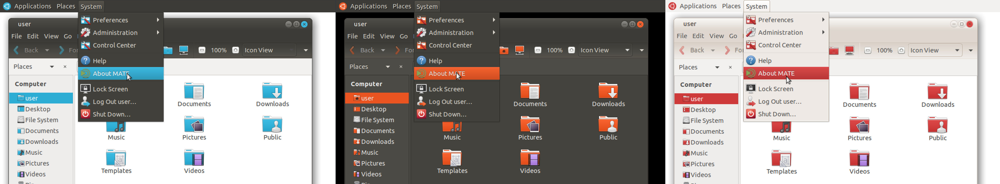
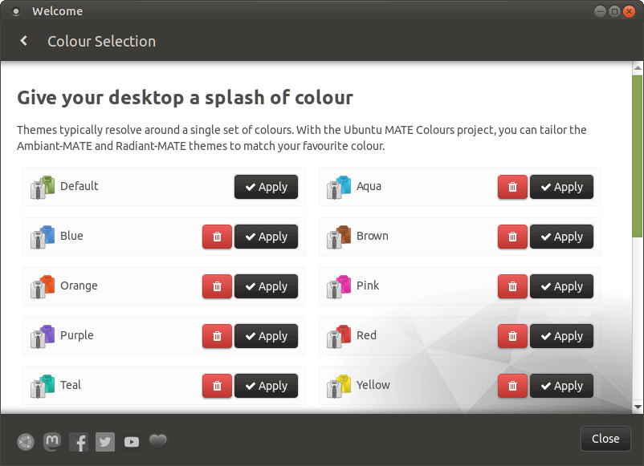

# Ubuntu MATE Colours

A small utility that takes `ubuntu-mate-artwork` (theme & icons)
and swaps out the green to a colour of your choice.

Only these themes are supported:

* Ambiant-MATE
* Ambiant-MATE-Dark
* Radiant-MATE

These versions are supported:

* Ubuntu MATE 18.04 LTS ("Bionic")
* Ubuntu MATE 20.04 LTS ("Focal")
* Ubuntu MATE 20.10 ("Groovy")

In addition, these wallpapers and applications themes are recoloured too:

| Jazz                  | Wall (Logo and Text)              | Wall (Logo)     |
| :-------------------: | :-------------------------------: | :-------------: |
|  |  | 

| Wall                  | Splash                            | Plank
| :-------------------: | :-------------------------------: | :-------------: |
|  |  | 

Ubuntu MATE users can conveniently access this feature via **Welcome** on 18.04
(and later)!

## Versioning

This project works with the latest upstream release of `ubuntu-mate-artwork`, which
is normally tested for the latest Ubuntu version. As a result, older (and LTS)
releases may include theme & icon updates not found in
`ubuntu-mate-themes` and `ubuntu-mate-icon-themes` packages for that release.

Rebuilds to `ubuntu-mate-colours` are represented by the fourth decimal, for example:

> 19.10.5.**2** = **2**nd build based on 19.10.5.

## Installation

Packages are available for both the generator and pre-defined colours.
On Ubuntu, simply add the PPA and install the packages as desired.

    sudo add-apt-repository ppa:lah7/ubuntu-mate-colours

The following colours are available:

| Aqua                  | Blue                  | Brown                  | Orange                  | Pink                  | Purple                  | Red                  | Teal                  | Yellow                  |
| :-------------------: | :-------------------: | :--------------------: | :---------------------: | :-------------------: | :---------------------: | :------------------: | :-------------------: | :---------------------: |
|  |  |  |  |  |  |  |  |  |
| `#2DACD4`             | `#5489CF`             | `#965024`              | `#E95420`               | `#E231A3`             | `#7E5BC5`               | `#CE3A3A`            | `#1CB39F`             | `#DFCA25`               |

Packages are split by colour, so installing `ubuntu-mate-colours-blue` will
give you the blue variants of Ambiant-MATE, Ambiant-MATE-Dark and Radiant-MATE.

    sudo apt install ubuntu-mate-colours-blue

Want them all? This may take at least 600 MB of disk space!

    sudo apt install ubuntu-mate-colours-all

After installing, themes/icons will be available from **Appearance** (Look & Feel).

## Generator Usage

Got a different colour in mind? Create your own using the generator:

    sudo apt install ubuntu-mate-colours-generator

First, make sure you have an up-to-date copy of the [`ubuntu-mate-artwork` repository](https://github.com/ubuntu-mate/ubuntu-mate-artwork).
If you have `git` installed, you can make a clone using this command:

    git clone https://github.com/ubuntu-mate/ubuntu-mate-artwork.git --depth=1

To update this copy without re-downloading everything in future:

    cd ubuntu-mate-artwork
    git pull --rebase origin master

It is possible to use your currently installed installation of the theme & icons
by specifying `/` for `--src-dir`, but please be aware this project is designed to
work with the latest version of the theme & icons.

#### Required arguments

| Argument          | Description                                             |
| ----------------- | ------------------------------------------------------- |
| `--theme`         | Ubuntu MATE theme to use, such as Ambiant-MATE.
| `--hex`           | Standard #RRGGBB hex value.
| `--name`          | A human readable name to describe this colour.
| `--src-dir`       | Path to the root of the `ubuntu-mate-artwork` repository.

For **hex**, you can use colour picker applications to choose the colour.

    mate-color-selection
    zenity --color-selection

For example:

    ubuntu-mate-colours-generator --theme="Ambiant-MATE" --hex="#5489CF" --name="Blue" --src-dir=/home/user/ubuntu-mate-artwork

The script by default will create the theme in `~/.local/share/themes` and
`~/.local/share/icons`, making it available to the local user.

#### Optional arguments

| Argument               | Description                                       |
| ---------------------- | ------------------------------------------------- |
| `--install-icon-dir`   | Target path to process/install the new icons.
| `--install-theme-dir`  | Target path to process/install the new theme.
| `-v` or `--verbose`    | Show details of each file being processed.
| `-y` or `--overwrite`  | Suppress confirmation prompt to replace target path.
| `--ignore-existing`    | Ignore theme/icons files if they already exist.
| `--list-tweaks`        | List optional modifications that can be made.
| `--tweaks`             | Comma separated list of tweaks to use.

#### Tweaks

After generating the coloured theme, you may wish to optionally modify the theme
further:

| Tweak Name             | Description                                       |
| ---------------------- | ------------------------------------------------- |
| `mono-osd-icons`       | [Use monochrome icons for OSD volume pop up (#14)](https://github.com/lah7/ubuntu-mate-colours/issues/14)
| `black-selected-text`  | [The selected text colour is black instead of white (#21)](https://github.com/lah7/ubuntu-mate-colours/issues/21)

These are passed as a comma separated parameter to `--tweaks`.

## Generated your own?

Don't forget to update your copy as time passes. To keep it up-to-date, pull the
latest changes from `ubuntu-mate-artwork` and run this program again. If
forgotten for too long, you may miss out on bug fixes and improvements
present in the `ubuntu-mate-themes` package.

## License

Both this program and [`ubuntu-mate-artwork`](https://github.com/ubuntu-mate/ubuntu-mate-artwork)
are licensed under the GPLv3.
