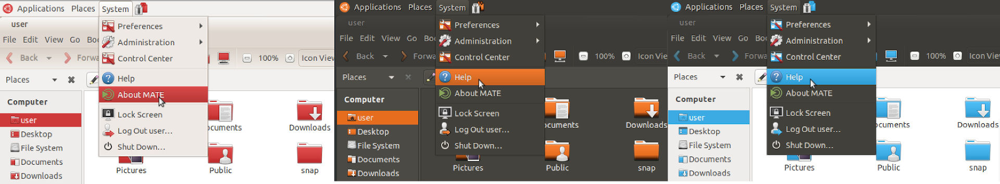

# Ubuntu MATE Colours



This small program take the existing `ubuntu-mate-artwork`
theme and icons and switches the green colour to one of your choice.

Only these themes are supported:

- Ambiant-MATE
- Ambiant-MATE-Dark
- Radiant-MATE


> :warning: This program is a work in progress!


## Install

Either download this repository and run `generate-ubuntu-mate-colours`, or
on Ubuntu, add this PPA to the system:

```
sudo add-apt-repository ppa:lah7/ubuntu-mate-colours
sudo apt install ubuntu-mate-colours-generator
```

In future, there will be packages for predefined colours, saving the need to
acquire the source repositories, with the added bonus of staying up-to-date.


## Usage

First, make sure you have an up-to-date copy of the [`ubuntu-mate-artwork` repository](https://github.com/ubuntu-mate/ubuntu-mate-artwork).
If you have `git` installed, you can make a clone using this command:

    git clone https://github.com/ubuntu-mate/ubuntu-mate-artwork.git --depth=1

In future, to update this copy without re-downloading everything:

    cd ubuntu-mate-artwork
    git pull --rebase origin master


#### Required arguments

```
--theme <THEME>       Ubuntu MATE theme to use, e.g. 'Ambiant-MATE'
--hex <HEX>           Colour value to use, e.g. '#3cabe4'
--name <NAME>         Human readable suffix to identify variant, e.g. 'blue'.
--src-dir             Path to ubuntu-mate-artwork repository
```


#### Optional arguments

```
--install-icon-dir    Path to install coloured icons
--install-theme-dir   Path to install coloured theme
-v, --verbose         Show details of each file being processed
-y, --yes             Assume yes to replace existing target directory
```

For example:

    ./recolour-ubuntu-mate.py --theme="Ambiant-MATE" --hex="#3cabe4" --name="blue"

The script by default will create the theme in `~/.local/share/themes` and
`~/.local/share/icons` based on the contents of the `ubuntu-mate-artwork` repository.


#### Example Hex Codes

| Hex       | Colour          |
| --------- | --------------- |
| #2dacd4   | Aqua
| #5489CF   | Blue
| #7F441F   | Brown
| #679816   | Green (alternate)
| #E66C1E   | Orange
| #E231A3   | Pink
| #7E5BC5   | Purple
| #CE3A3A   | Red
| #1CB39F   | Teal
| #D8A200   | Yellow


You can use colour picker applications to choose your own colours.

    mate-color-selection
    zenity --color-selection


## Remember to update!

It should be noted that generating your own custom variant of the theme means it
is your responsibility to keep it updated by re-running this script, especially
between distro releases or major fixes in the `ubuntu-mate-artwork` package.


## License

Both this program and [`ubuntu-mate-artwork`](https://github.com/ubuntu-mate/ubuntu-mate-artwork)
are licensed under the GPLv3.
